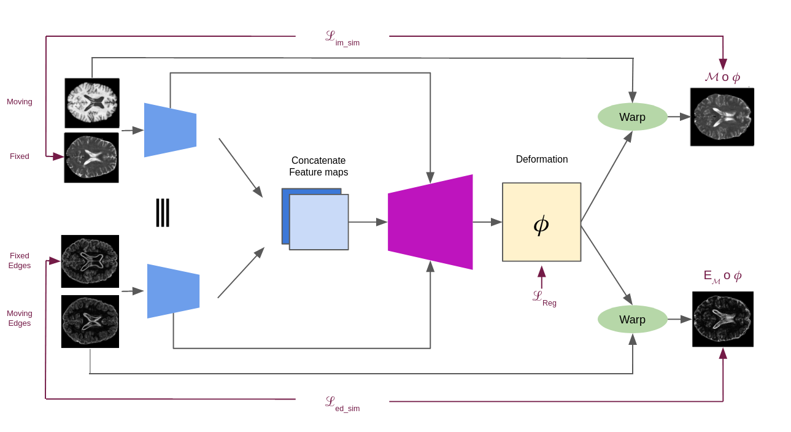

# Multi-modal unsupervised brain image registration using edge maps

This repository contains the code described in the paper [Multi-modal unsupervised brain image registration using edge maps](https://arxiv.org/pdf/2202.04647.pdf).

The current work extends the one of Qui et al. [Learning Diffeomorphic and Modality-invariant Registrationusing B-splines](https://openreview.net/pdf?id=eSI9Qh2DJhN). For more information on the original models, the file structure, configurations, training your own model, hyper-parameter tuning and inference, please consider visiting their repository: [https://github.com/qiuhuaqi/midir](https://github.com/qiuhuaqi/midir).

Please consider citing the paper if you use the code in this repository.


The image presents an overview of the method.


## Installation
1. Clone this repository
2. In a fresh Python 3.8.x virtual environment, install dependencies via:
    ```
    pip install -r <path_to_cloned_repository>/requirements.txt
    ```

### Comments
We tested the code on a Quadro RTX 8000 GPU using CUDA 11.3 and CuDNN 8.3.

## Contact Us
If you have any question or need any help running the code, feel free to open an issue or email us at:
[vasiliki.sideri-lampretsa@tum.de](mailto:vasiliki.sideri-lampretsa@tum.de)
